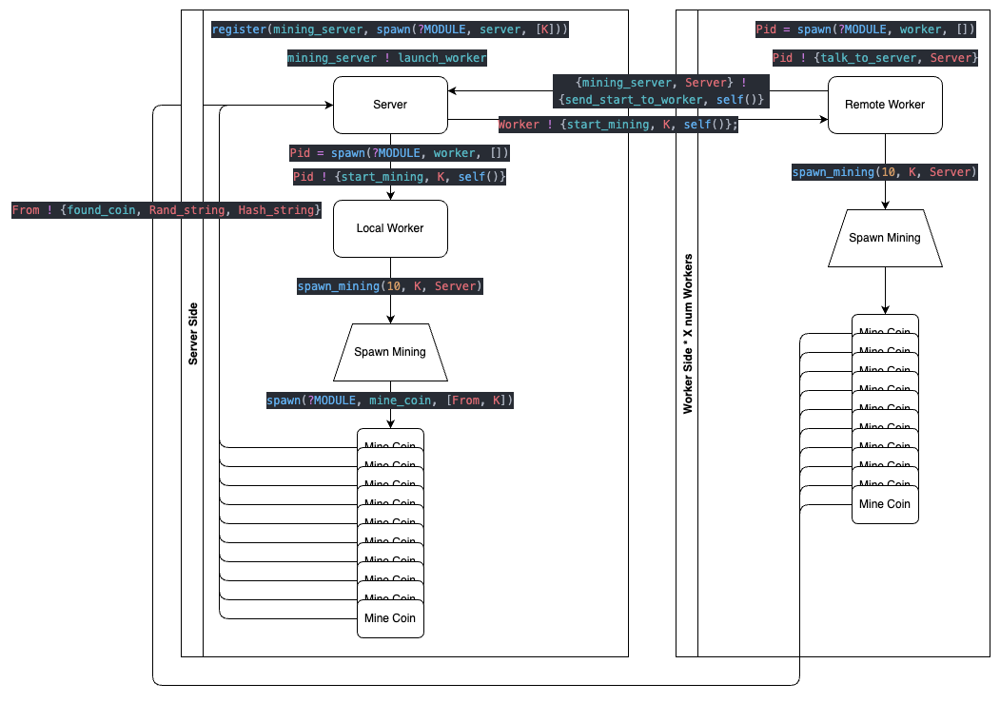

# Project 1

By: Jonathan Bravo & Yu Hong

## Usage

First you must `cd` into the project directory to compile the code. This can be
done two ways. Either in a single line using:

```erlang
erlc project1.erl
```

or inside of an erlang vm using `erl` and then once the vm is active typing:

```erlang
c(project1).
```

If you wish to _host_ a server you would start a node, but may run the
`start_server(K).` function without starting a node if you wish to mine locally
only.

To start a node you would type:

```erlang
erl -name name@server_ip
```

And then you can execute the code by typing the following in an erlang shell:

```erlang
project1:start_server(4). %4 can be replaced by the desired number of 0s
```

This will start a server that then starts a worker that then starts 10 mining
processes, so you will see see output on code execution. If you want to mine
additional coins with the input value of `K` you can type:

```erlang
mining_server ! launch_worker
```

This is the registered atom for the server you started. We would be sending
instructions to start a new worker, which in turn would start 10 more mining
processes.

If you would like to mine for coins with a different value of `K` then you must
`q().` quit out of the erlang vm and then start it again and run the
`project1:start_server(K).` function with a different value of `K`.

Workers can be started on remote machines by following the same compilation
steps as above, but the function to execute in an erlang shell is:

```erlang
project1:start_worker('name@server_ip').
```

This will start a worker and send all coins to the server.

&nbsp;

### Special Notes On Nodes and Connections

To connect my partner and I had to use `ifconfig` to get our ip address and
then edit our `/etc/hosts` file to include it at the end as follows:

```
10.0.0.1 erlangnode
```

We also had to set up a file called an erlang cookie in our home directories
that contained the same string so that our nodes would connect as follows:

```
echo this_is_secret > ~/.erlang.cookie
```

If we both did this with the same string and then both included our ip addresses
as the erlangnode, we were able to make our erlang nodes communicate.

&nbsp;

## Flow Diagram



&nbsp;

## Work Unit Size

On start each worker spawns 10 mining processes of their own. We tried higher
values but noticed that cpu usage actually fell. We measured this with a
combination of the `time` command and using the system monitor when mining for
coins with a `K` of 5 or larger. We were able to maximize CPU utalization at
around 8 to 10 mining processes - going with 10 because that generates more
coins.

&nbsp;

## Results for input 4

```
1> project1:start_server(4).
4
jonathan.bravo;CEe74Zhl 0000209f878a7760c1f69a2647da71f9a6d9a3cc441cda79048c208fca3d5e2c
jonathan.bravo;7OEvMvm9 0000addfd9af45dc9b08eba852416461522d3dacd513b6a48f6156ac86a4862a
jonathan.bravo;fuBmYjCW 00006d6f3f5cf57dd0dc76a5c07e8a93f5f0af42d6001878f8c53742d2da308f
jonathan.bravo;1i/ELz3H 0000e3cdd3d759205009d6dd44377e841313d680aac79cdf441b78a16ee7791c
jonathan.bravo;4jhq3wT6 00002ea5e8327720744fa136631b9ad255d66d17ea6e68d57851a696e4e59336
jonathan.bravo;yeKs9Sw3 0000b4b18883ad658e10c9f990e1e90039c24ea2de3b2341a22baf396fd8a84c
jonathan.bravo;LqBE3JvS 00000fee6d35c676f8fa5cd7bf7ba83d8d9281bd5d1390028b877b5871936239
jonathan.bravo;oUC5HD4D 0000a0287ec837ceeaa0d2a7011dc17ae3b52db06884a41d48ee3b3e1deefe32
jonathan.bravo;bl9tJR7V 000097eac9002dbdc7c7ef3b8c97956925ffa3a6a5ed2ddf23b14c3255bfd30a
jonathan.bravo;3H+SkEd4 000055bd8c7bbc76a1d735ec52507f5af484d51b2f8ee64129a0de8d483a5f34
```

These results come from just launching the server using
`project1:start_server(4).` without any additional workers.

&nbsp;

## Run Time

```shell
Project1 λ: time erl
Erlang/OTP 25 [erts-13.0.4] [source] [64-bit] [smp:8:8] [ds:8:8:10] [async-threads:1] [jit] [dtrace]

Eshell V13.0.4  (abort with ^G)
1> project1:start_server(5).
5
jonathan.bravo;rIdTEyzk 00000fb1af27a0291ec58636b454b3e04fc36f117c55661830ec57980d8d5e9d
2> q().
ok
jonathan.bravo;3XCHlR8M 00000cff07a81d6d507c22824d8cec62e6644ae8c60e87493aaf37b7b2a09321
jonathan.bravo;PS9IL2Av 0000046df17c994b368c58be1a85a031830db24bdb4db0a72fa1beefa40f606c
jonathan.bravo;TlVdJlpm 000005c384fc8db693ab4e4fad2c9cc8aafe5269f0b2fe6c4fa601c3a9d68726
3> erl  20.75s user 8.99s system 234% cpu 12.688 total
```

From the above we can see that:

> User time __is__ 20.75 seconds + System time __is__ 8.99 seconds = 29.74s 
>
> Real time = 12.688s
>
> Ratio = 2.344
> 
> This was done on a macbook pro with M1 - results may differ on x86 machines 

&nbsp;

## Most 0s

```
jonathan.bravo;XdGhoTfl 000000094175bae1bf81e8c7b8cb0130f7e8306cbe86ffb2164e357beda480f3
```

Without letting the code run too long we were able to find a coins that had 7
leading zeros.

&nbsp;

## Largest Number of Working Machines

We tested with 3 machines in total - one server and two workers. Theoretically,
since the number of erlang ports is ~16,000 one could connect quite a number of
workers to the server.