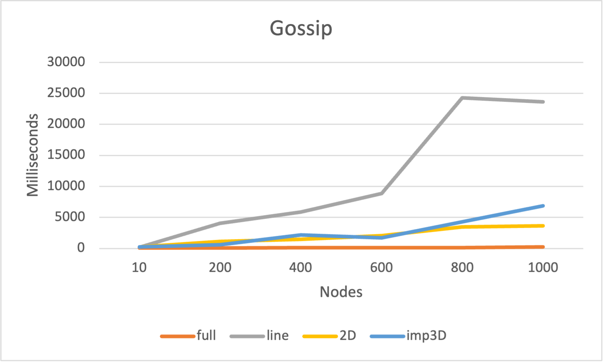
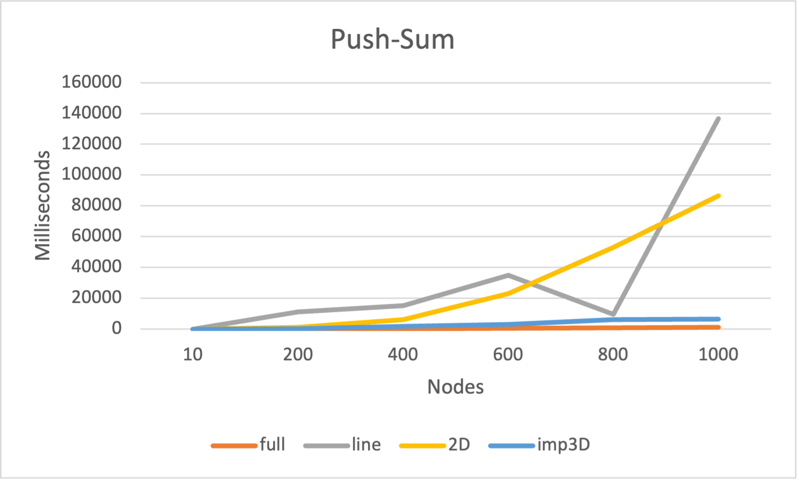

# Project 2

By: Jonathan Bravo UFID: 11869914 & Yu Hong UFID: 35156371

## Usage

### Building

First you must `cd` into the project directory to compile the code. This can be
done two ways. Either in a single line using:

```erlang
erlc project2.erl
```

or inside of an erlang vm using `erl` and then once the vm is active typing:

```erlang
c(project2).
```

### Running Code

Code can be run by typing this format
`project2:start(numNodes, topology, algorithm).` into an erlang shell. Choices
for **topology** are: `'line'`, `'full'`, `'2D'`, and `'imp3D'`. Choices for
**algorithm** are: `'gossip'`, and `'push-sum'`. **numNodes** is any integer
larger than 1.

Ex:

```erlang
project2:start(5, 'full', 'gossip').
```

## What is working

We were able to get the standard functionality into the code. Both algorithms
work as well as all 4 topologies.

### Topologies

- **line**
  - input = `'line'`
  - Any given node can only access its neighbord behind or inforont of it in
    the list (line)
- **full**
  - input = `'full'`
  - Any node can access any other node in the list of nodes
- **2D**
  - input = `'2D'`
  - Actors will form a 2d grid and can only talk to their neighbords - selected 
    randomly
- **imp3D**
- input = `'imp3D'`
- Actors will form a 3d cube, but this time a node can select from any node
  that is it's direct neighbor **plus** an additional node from a different Z
  layer of the cube

### Algorithms

- **gossip**
  - input = `'gossip'`
  - To start, the server randomly selects a node to pass the _rumor_ to.
    The _rumor_ is passed to a random neighbor node, when a node recieves
    the _rumor_ **it** then selects a random node to send the fact to as well.
    All nodes that have recieved the _rumor_ will select a random node (from
    the avalable choices based on topology) and send the _rumor_ to them
  - Nodes will keep track of the number of times they have heard the _rumor_
    and after the node has heard the rumor $n$ number of times then it will
    conclude the propagation. All the other nodes will continue to send the
    rumor until they have heard the rumor the requisite number of times
- **push-sum**
  - input = `'push-sum'`
  - **State:** Each actor _Ai_ maintains two quantities: _s_ and _w_. Initially,
    _s_  = _xi_ = _i_ (that is actor number _i_ has value _i_, play with other
    distribution if you so desire) and _w_ = 1
  - **Starting:** Ask one of the actors to start from the main process.
  - **Receive:** Messages sent and received are pairs of the form (_s, w_).
    Upon receiving, an actor should add the received pair to its own
    corresponding values. Upon receiving, each actor selects a random neighbor
    and sends it a message.
  - **Send:** When sending a message to another actor, half of _s_ and _w_
    is kept by the sending actor, and half is placed in the message.
  - **Sum Estimate:** At any given moment of time, the sum estimate is $s/w$
    where s and w are the current values of an actor.
  - **Termination:** If an actor's ratio s/w did not change more than
    10<sup>−10</sup> in 3 consecutive rounds the actor terminates.

## Largest Network

The largest network we were able to support before our machine killed the
erlang vm was `project2:start(3000, 'full', 'gossip').`.

## Tables and Graphs

### Gossip - full
| NumNodes | RunTime (ms) |
| - | - |
| 10 | 52 |
| 200 | 76 |
| 400 | 95 |
| 600 | 108 |
| 800 | 118 |
| 1000 | 232 |

### Gossip - line
| NumNodes | RunTime (ms) |
| - | - |
| 10 | 178 |
| 200 | 4041 |
| 400 | 5871 |
| 600 | 8856 |
| 800 | 24276 |
| 1000 | 23651 |

### Gossip - 2D
| NumNodes | RunTime (ms) |
| - | - |
| 10 | 224 |
| 200 | 1086 |
| 400 | 1446 |
| 600 | 2070 |
| 800 | 3455 |
| 1000 | 3623 |

### Gossip - imp3D
| NumNodes | RunTime (ms) |
| - | - |
| 10 | 263 |
| 200 | 592 |
| 400 | 2150 |
| 600 | 1713 |
| 800 | 4285 |
| 1000 | 6849 |

### Push-Sum - full
| NumNodes | RunTime (ms) |
| - | - |
| 10 | 4 |
| 200 | 67 |
| 400 | 182 |
| 600 | 410 |
| 800 | 692 |
| 1000 | 1023 |

### Push-Sum - line
| NumNodes | RunTime (ms) |
| - | - |
| 10 | 7 |
| 200 | 11224 |
| 400 | 15103 |
| 600 | 35046 |
| 800 | 9756 |
| 1000 | 136465 |

### Push-Sum - 2D
| NumNodes | RunTime (ms) |
| - | - |
| 10 | 2 |
| 200 | 1265 |
| 400 | 6042 |
| 600 | 23007 |
| 800 | 52934 |
| 1000 | 86422 |

### Push-Sum - imp3D
| NumNodes | RunTime (ms) |
| - | - |
| 10 | 12 |
| 200 | 291 |
| 400 | 1875 |
| 600 | 3177 |
| 800 | 6044 |
| 1000 | 6639 |

### Gossip Plot



### Push-Sum Plot

