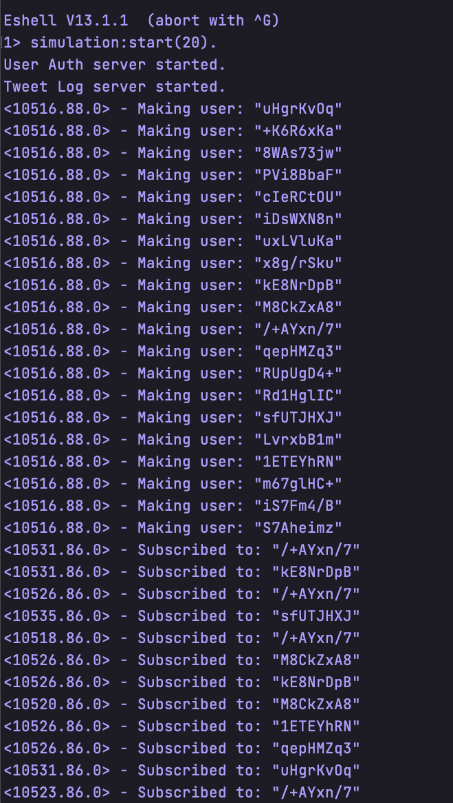
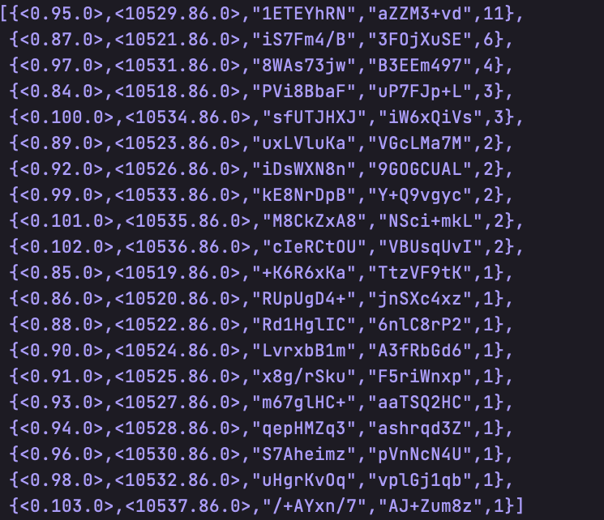
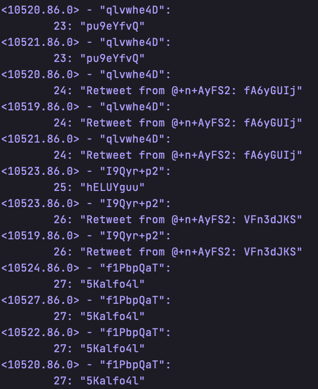

# Project 4 part 1

By: Jonathan Bravo UFID: 11869914 & Yu Hong UFID: 35156371

## Usage

### Compiling

First you must `cd` into the project directory to compile the code. This can be
done two ways. Either in a single line using:

```erlang
erlc project4.erl
erlc simulation.erl
```

or inside of an erlang vm using `erl` and then once the vm is active typing:

```erlang
c(project4).
c(simulation).
```

### Running Code

Code can be run by typing this format
`project4:start_host().` into an erlang shell.

Ex:

```erlang
project4:start_user('test1','host@HaKmonkey-Mac').
```

The simulation can be run by starting an erlang shell and typing the following
command:

```erlang
simulation:start(10) % 10 is the number of users
```

The number of users to simulate can be adjusted here.

## What is working

We were able to get the standard functionality into the code. There is a twitter engine
 that users can register an new account, send twitter messages, and follow other users.
Also support the search twitters by tags or mentions. Each time the search result will 
print out in user's console. If users subscribed to others, they will receiver other's 
newest twitters.

A user can register a new account by typing:

```erlang
hostID ! {new_user, "user1", "test1"}.
```

A user can subscribe to another user by typing:

```erlang
hostID ! {subscribe, "user2"}.
```

A user can login by typing:

```erlang
hostID ! {login, "user1", "test1"}.
```

A user can log off by typing:

```erlang
hostID ! logoff.
```

A user can send a twitter by typing:

```erlang
hostID ! {make_tweet, "Tweet Message"}.
```

A user can search twitters by tag by typing:

```erlang
hostID ! {search_tweets_by_tag, "#tag"}.
hostID ! search_tweets_by_mention.
hostID ! search_tweets_by_subscription.
```

A user can re-tweets by typing:

```erlang
hostID ! {retweet, queryID}.
```

A user can see the help function by typing:

```erlang
hostID ! help.
```

The above is an example and the hostID will change depending on the number of nodes
that are spawned. Each time user's action will be displayed in host console. Also If 
it will display on user's console if users are trying to search their tweets. If users
subscribed to others, they will receiver other's newest twitters.
The hostID should be entered as follows `<0.89.0>`. 

## Largest Network

We were able to simulate 30 users from a single machine, theoretically there can
be many more users if the script is run as it should be with a host on one machine
and users connecting in from their own machines.


## Additional Comments

Each time, we need to start the host server first, then other users can start yo login
or send tweets. We used the ets table to store all those infomation. We have three tables 
to keep this program running. The first table is to store all the users' information. The 
second table is to store all the tweets' information. The last table is used to maintain all 
those user's relationship.

### Simulation

1. Start host
2. Spawn user nodes (should be remote in real use case)
3. Run the `start_user` function for all user nodes



4. Grab all usernames
5. Generate new users
6. Have users subscribe randomly to other users
7. Get the subscriptiton frequency and sort by frequency
8. Get the zipf frequency of tweets for users
9.  Generate a base number of tweets depending on the number of users



10. Make the tweets, when the users get to the half way point of their tweets they have a chance to retweet



11. Test the searching by mention, which took 500 ms
    1. The request happens almost instantly so this is dues to the timer delay
    2. Was not able to test searching by tags with this simulation because of the randomly generated tweets
12. Some users log off
13. Tweets happen again to demonstrate that tweets are not delivered to offline users