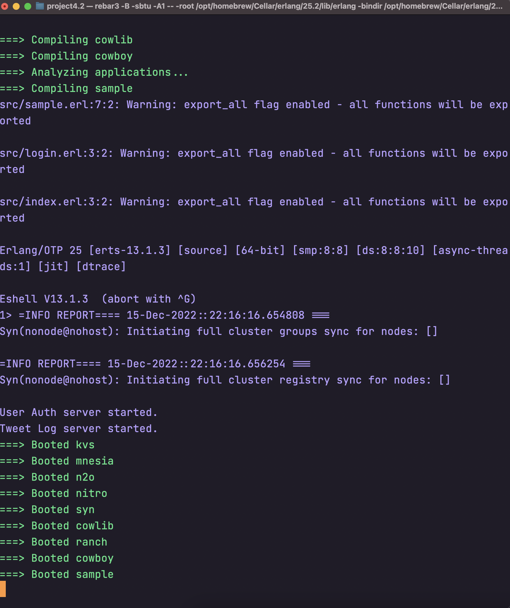
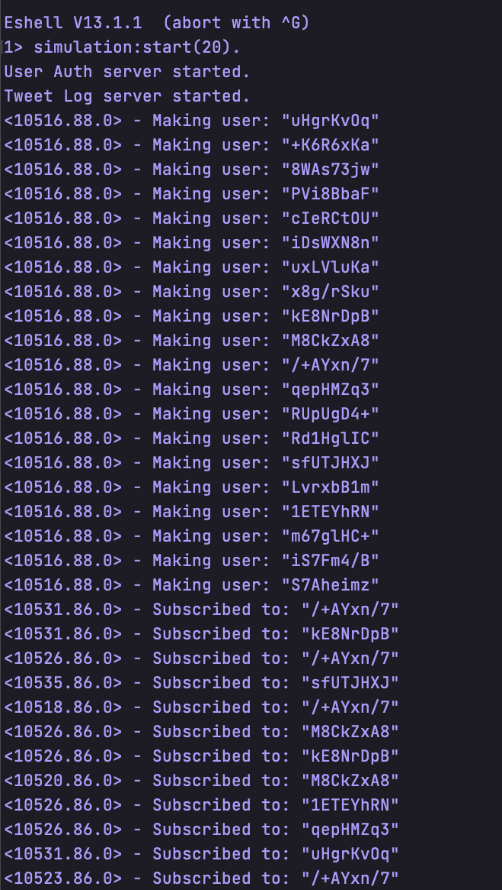
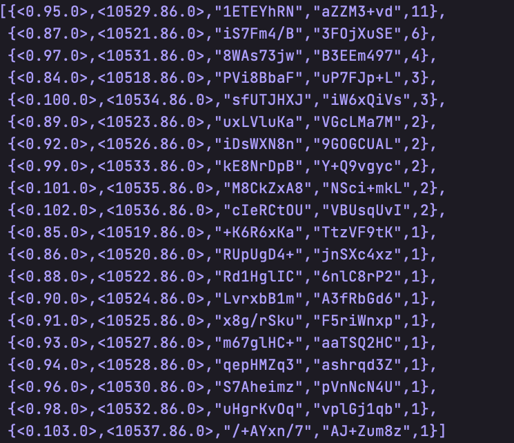
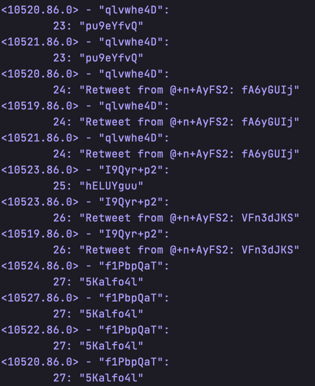

# Project 4 part II

By: Jonathan Bravo UFID: 11869914 & Yu Hong UFID: 35156371

## Video Link

https://youtu.be/uAjz6QIASHY

## Introduction

In this project, we used the N2O framework(https://github.com/synrc/n2o) to set up the front end server. 
We used the Project 4 Part I as our back end server. 
The users can create new account, login, post tweetes and follow other userss in the website. 

## What is working

We were able to get the standard functionality into the code. There is a twitter engine
 that users can register an new account, send twitter messages, and follow other users.
Also support the search twitters by tags or mentions. Each time the search result will 
print out in user's console. If users subscribed to others, they will receiver other's 
newest twitters. Each time the user login, the front-end will send message to the back-end
to verify the username and the password. If it's correct, it will return correct message to the 
front-end. In all those communication, the message is sent in JSON structure.
Then users will be redirect to the index page where users can see their tweets, send new tweets,
follow other users, and search twitters(by tag or by mention). All those functions are working in the same method as we described in previous.

## Usage

 use the command `rebar3 shell` to start the back-end server. Then execute command `open http://localhost:8001/app/login.htm` to open the fron-end website.

 

## Largest Network

We were able to simulate 30 users from a single machine, theoretically there can
be many more users if the script is run as it should be with a host on one machine
and users connecting in from their own machines.

## Additional Comments

Each time, we need to start the host server first, then other users can start yo login
or send tweets. We used the ets table to store all those infomation. We have three tables 
to keep this program running. The first table is to store all the users' information. The 
second table is to store all the tweets' information. The last table is used to maintain all 
those user's relationship.

### Simulation

1. Start host
2. Spawn user nodes (should be remote in real use case)
3. Run the `start_user` function for all user nodes

4. Grab all usernames
5. Generate new users
6. Have users subscribe randomly to other users
7. Get the subscriptiton frequency and sort by frequency
8. Get the zipf frequency of tweets for users
9.  Generate a base number of tweets depending on the number of users

10. Make the tweets, when the users get to the half way point of their tweets they have a chance to retweet

11. Test the searching by mention, which took 500 ms
    1. The request happens almost instantly so this is dues to the timer delay
    2. Was not able to test searching by tags with this simulation because of the randomly generated tweets
12. Some users log off
13. Tweets happen again to demonstrate that tweets are not delivered to offline users